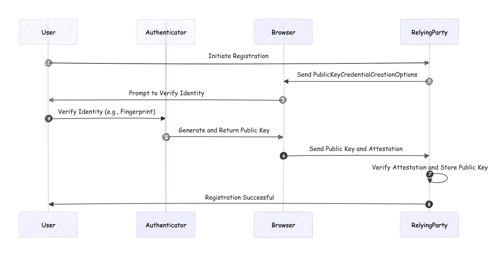
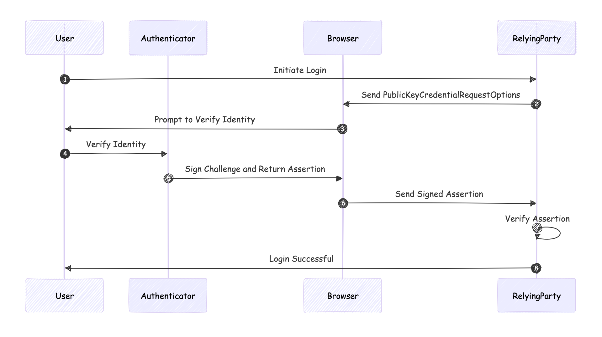

## WebAuthn process
WebAuthn (Web Authentication) is a standard for secure authentication on the web using public key cryptography. The process involves multiple steps to ensure a secure and user-friendly authentication mechanism. Here are the key steps involved in the WebAuthn process:

### 1. Registration (or Enrollment) Process:
#### a. User Initiates Registration
- The user starts the registration process on a website (relying party) that supports WebAuthn.

#### b. Relying Party Requests Credentials
- The relying party generates a `PublicKeyCredentialCreationOptions` object that contains challenge data, relying party information, user information, and other parameters required for the credential creation.

#### c. User Verifies and Creates Credentials
- The browser, which supports WebAuthn, prompts the user to verify their identity using an authenticator (e.g., a fingerprint sensor, security key, or facial recognition).
- The authenticator generates a new key pair (public and private keys).
- The private key is stored securely on the authenticator, while the public key and other relevant data (like the attestation) are sent back to the relying party.

#### d. Relying Party Verifies Registration
- The relying party verifies the received attestation object and the associated public key.
- If the verification is successful, the public key is stored in the user’s account for future authentications.

### 2. Authentication (or Login) Process:
#### a. User Initiates Login
- The user initiates the login process on the website.

#### b. Relying Party Requests Assertion
- The relying party generates a `PublicKeyCredentialRequestOptions` object that includes a challenge and other relevant parameters.
- This is sent to the browser to begin the authentication process.

#### c. User Verifies Identity
- The browser prompts the user to verify their identity using the previously registered authenticator.
- The authenticator signs the challenge using the stored private key.

#### d. Authenticator Returns Assertion
- The authenticator returns the signed assertion (which includes the signed challenge and other data) to the browser.
- The browser sends this assertion back to the relying party.

#### e. Relying Party Verifies Assertion
- The relying party verifies the signed assertion using the stored public key.
- If the verification is successful, the user is authenticated and granted access to their account.

### Key Components:
- **Authenticator**: A device or software that generates and stores key pairs, and performs cryptographic operations.
- **Client**: The user’s browser or web application that facilitates the WebAuthn process.
- **Relying Party**: The website or service that requests and verifies the user’s credentials.

### Security Features:
- **Challenge-Response Mechanism**: Ensures that each authentication is unique and prevents replay attacks.
- **Public Key Cryptography**: Uses asymmetric key pairs to keep the private key secure on the authenticator.
- **Attestation**: Provides proof of the authenticator’s validity during registration.

WebAuthn enhances security by eliminating the need for passwords, making it resistant to phishing attacks, and providing a more user-friendly authentication experience.

<!--
Registration process
sequenceDiagram
    autonumber
    participant User
    participant Authenticator
    participant Browser
    participant RelyingParty

    User->>RelyingParty: [a] Initiate Registration
    RelyingParty->>Browser: Send PublicKeyCredentialCreationOptions
    Browser->>User: Prompt to Verify Identity
    User->>Authenticator: Verify Identity (e.g., Fingerprint)
    Authenticator->>Browser: Generate and Return Public Key
    Browser->>RelyingParty: Send Public Key and Attestation
    RelyingParty->>RelyingParty: Verify Attestation and Store Public Key
    RelyingParty->>User: Registration Successful
-->
### Registration process
1. The user initiates registration on the relying party.
2. The relying party sends PublicKeyCredentialCreationOptions to the browser.
3. The browser prompts the user to verify their identity using an authenticator.
4. The user verify using an avilable authenticator (passkey, yubikey, etc)
5. The authenticator generates a public-private key pair, sends the public key to the browser
6. The browser then sends the public key attestation to the relying party.
7. The relying party verifies the attestation and stores the public key with the user account.
8. The relying party return registration result.

<!--
Authentication process
sequenceDiagram
    autonumber
    participant User
    participant Authenticator
    participant Browser
    participant RelyingParty

    User->>RelyingParty: Initiate Login
    RelyingParty->>Browser: Send PublicKeyCredentialRequestOptions
    Browser->>User: Prompt to Verify Identity
    User->>Authenticator: Verify Identity
    Authenticator->>Browser: Sign Challenge and Return Assertion
    Browser->>RelyingParty: Send Signed Assertion
    RelyingParty->>RelyingParty: Verify Assertion
    RelyingParty->>User: Login Successful
-->
### Authentication process
1. The user initiates login on the relying party.
2. The relying party sends PublicKeyCredentialRequestOptions to the browser.
3. The browser prompts the user to verify their identity.
4. The user choose an available authenticator to verify identity.
5. The authenticator signs the challenge and returns the assertion to the browser.
6. The browser sends the assertion to the relying party.
7. The relying party verifies the assertion.
8. The relying party grants or denies access to the user base on the verification result.

